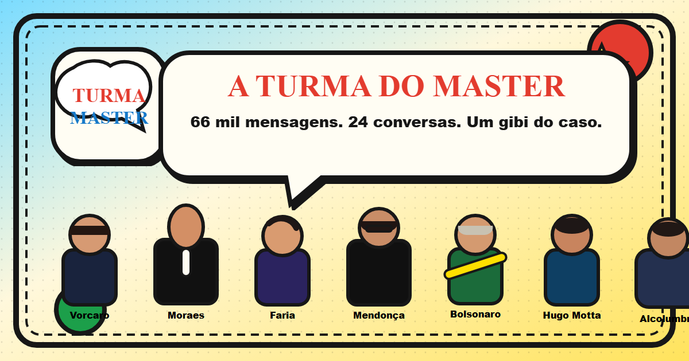

# A Turma do Master

Um gibi político-financeiro disfarçado de conversa.

São **66.387 mensagens** dos celulares apreendidos de Daniel Vorcaro (Banco Master), em **24 conversas**. De Martha Graeff a Alexandre de Moraes. Dá para ler, buscar, pular data, copiar trecho e mandar o link direto na mensagem.

**[Ao vivo: turmadomaster.vercel.app](https://turmadomaster.vercel.app/)**

---

Dados iniciais juntados de Rafael Bressan, posteriormente modificados, atualizados e acrescentados por **[Luis Henrique](http://linkedin.com/in/luisnovaisg/)** usando **ChatGPT 5.5**.

Este repositório se chama `turma-do-master`. A ideia original veio do [MasterZap](https://www.reddit.com/r/brasil/s/xQeqrG27p8) de **Lucas Matheus**, feito no Replit com Grok. A Turma do Master parte dessa inspiração e troca a cara, a stack e o jeito de ler o material.

---

## O que é isso

Não é um dump. É um palco.

Cada contato entra como personagem da turma: foto ou avatar, perfil, o que o material revela e de onde veio. A interface parece conversa, mas o visual é gibi brasileiro original — tinta preta, amarelo, vermelho, contorno grosso. Sem copiar marca, personagem ou arte de terceiro.

O material chegou em duas levas:

1. **Março de 2026** — 65.772 mensagens com Martha Graeff, então noiva. Apelidos, poder, Miami, “peleleca”, “colação”.
2. **Setembro de 2026** — caiu o sigilo da IPJ-A nº 3298613/2026. A PF reconstruiu, a partir do iPhone de Vorcaro, o contato com o ministro Alexandre de Moraes e outras 22 pessoas. Não é export de WhatsApp: as falas estavam em imagens do laudo e foram transcritas uma a uma. Detalhe em [`data/ipj-3298613/README.md`](data/ipj-3298613/README.md).

## O que dá para fazer

- Buscar com acento ou sem: `sacanagem` acha `sacanagem`.
- Pular o calendário e cair no dia certo.
- Clicar com o botão direito, copiar o link e mandar alguém para a mensagem exata.
- Abrir o perfil de cada um e ler o contexto, não só o balão.
- Exportar uma conversa em `.md` / `.json`, ou baixar o zip com tudo.
- No celular, a lista vira app. No desktop, vira leitor de lado.
- Tem uma aba de **lutinha 2D** da turma. É brincadeira. O arquivo, não.

## Stack

Vanilla JS. Vite. Scripts Node. Zero framework.

Os dados viram JSON por dia, o app só carrega o que está na tela, com cache LRU. Deploy na Vercel, com headers de segurança e SEO (Open Graph, Twitter Card, JSON-LD, sitemap).

## Como rodar

```bash
git clone https://github.com/LuisHNovais/turma-do-master.git
cd turma-do-master
npm install
npm run split-data    # fatia as conversas em public/data/
npm run export        # markdown, json e zip em public/export/
npm run prerender     # depois do vite build: /chat/<id>, llms-full.txt, sitemap
npm run dev
```

Outros:

```bash
npm run build
npm run preview
npm run test          # Vitest
npm run test:e2e      # Playwright
```

## Pasta a pasta

```
src/                  # app
public/data/          # chunks gerados (gitignored)
public/export/        # export limpo (gitignored)
public/assets/        # logo, avatares, fundo
data/                 # fonte bruta
scripts/              # split, export, prerender
tests/unit/
tests/e2e/
```

## Export

- No chat: menu `⋮` → Exportar `.md` ou `.json`.
- Na lista: `⋮` → Exportar tudo (`.zip`).
- Por URL: `/export/turma-master-<conversa>.md`, `.json`, e os arquivos completos `turma-master.md`, `turma-master.json`, `turma-master-export.zip`.

O markdown traz proveniência, perfil e as mensagens dia a dia. As do laudo citam página e figura. O JSON guarda os mesmos metadados e o fuso `-03:00`. Quem gera isso é `scripts/export.mjs`, lendo os perfis do próprio app.

## Limites

- Só texto. Imagem, áudio, vídeo, sticker e documento entram como placeholder, porque não vieram no vazamento.
- Fora Alexandre de Moraes, as conversas do relatório da PF são recortes: o laudo cita o que a PF quis citar.

Se mais material aparecer, o `DataStore` já nasce por conversa, não por um chat só.

## Contribuição

PR bem-vindo: bug, acessibilidade, conversa nova, mídia, jeito melhor de citar trecho. Rode `npm run test` antes.

| Prioridade | Item | Status |
|------------|------|--------|
| Alta | Várias conversas | Feito — 24, duas fontes |
| Alta | Cache de busca por conversa | Feito |
| Média | Busca cruzada | Não |
| Média | Mídias de verdade | Esperando o conteúdo |
| Média | Compartilhar intervalo | Não |
| Baixa | 100+ conversas | Não |

## Aviso

Tudo aqui é público: reportagem, documento com sigilo levantado, fonte aberta. Este site não fala por Vorcaro, Martha, Moraes, banco, PF nem ninguém da turma.

---

## English

**A Turma do Master** is a comic-styled viewer for 66,387 WhatsApp messages from Daniel Vorcaro’s seized phones — 24 chats, from Martha Graeff to Justice Alexandre de Moraes. Vanilla JS, Vite, Node scripts. Search, calendar jump, permalink to a single bubble, profiles, export.

This repo is `turma-do-master`. It was inspired by the original [MasterZap](https://www.reddit.com/r/brasil/s/xQeqrG27p8) by **Lucas Matheus** (Replit + Grok). Initial data was gathered by Rafael Bressan, later modified, updated and expanded by **[Luis Henrique](http://linkedin.com/in/luisnovaisg/)** using **ChatGPT 5.5**.

**[Live: turmadomaster.vercel.app](https://turmadomaster.vercel.app/)**
